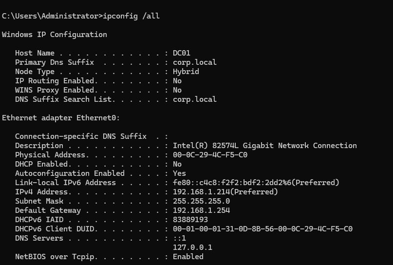
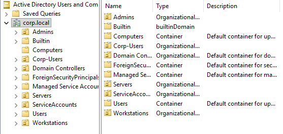

# Architecture Overview

## Environment Summary

This lab models a simplified enterprise Active Directory identity environment.

| Component | Details |
|------------|----------|
| Domain | corp.local |
| Domain Controller | DC01 (192.168.1.214) |
| Workstation | OYE (192.168.1.193) |
| Roles | AD DS, DNS |
| Log Source | Windows Security Log |

## Administrative Model

- corp\Administrator – Domain Admin
- corp\oye.admin – Delegated Admin
- ws.admin – Workstation Admin
- corp\svc-sql – Service Account (SPN enabled)

## Identity Trust Boundaries

- Domain Controller hosts authentication authority.
- Workstation consumes Kerberos tickets from DC.
- Service account configured with SPN exposes Kerberos TGS request surface.

## Attack Surface Areas Identified

- Service account Kerberos exposure (Kerberoasting risk)
- Privileged group membership manipulation
- Lateral movement via valid accounts
- Insufficient logging visibility (pre-hardening)

Architecture validation evidence located in `/evidence`.

## Supporting Evidence

- DC01 IP Configuration  
  

- Workstation IP Configuration  
  

- OU Structure  
  
