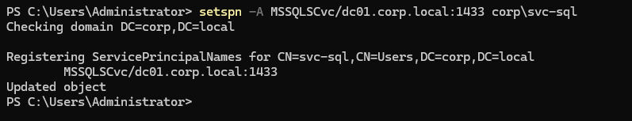
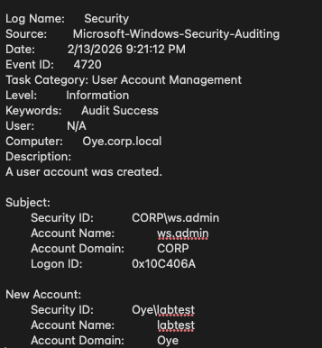
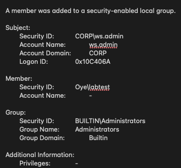
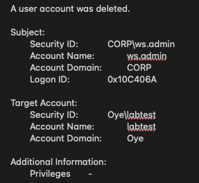

# Attack Simulation

## Objective

Simulate realistic Active Directory attack behaviors and validate telemetry generation.

---

## Scenario 1: Service Account + SPN Exposure

- Created domain service account: corp\svc-sql
- Configured SPN: MSSQLSvc/dc01.corp.local:1433
- Generated Kerberos TGS request
- Observed encryption type 0x17 (RC4)

Event ID: 4769

---

## Scenario 2: Privilege Escalation Simulation

1. Created new domain user (4720)
2. Added user to Domain Admins group (4732)
3. Deleted user (4726)

Purpose: Validate account manipulation telemetry and audit trail.

---

## Scenario 3: Command Execution Monitoring

- Enabled process creation logging
- Validated command-line capture
- Event ID 4688 confirmed

---

## Scenario 4: Logon Pattern Analysis

- Logon Type 3 (Network)
- Logon Type 10 (RDP)

Event ID: 4624

All evidence located in `/evidence`.

## Supporting Evidence

### Service Account + SPN

### Privilege Escalation

### Process Execution

### Logon Analysis

