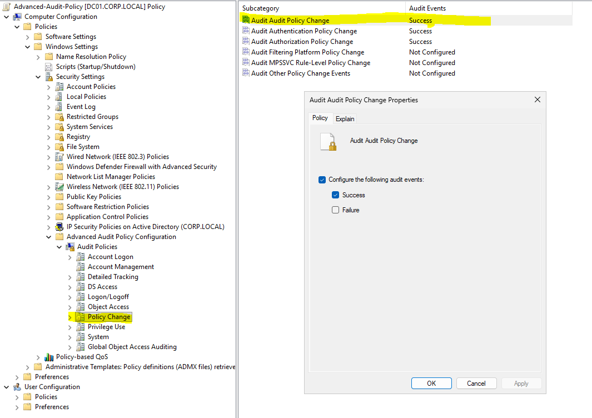
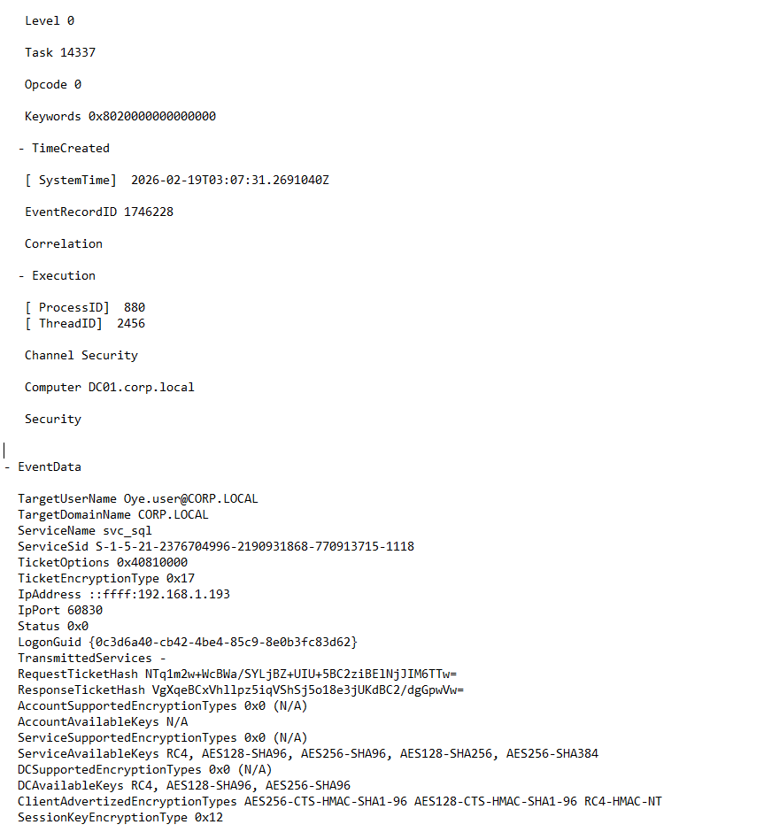

# Detection Engineering

## Audit Controls Implemented

- Advanced Audit Policy enabled
- Account Management auditing configured
- Process Creation logging (4688) enabled
- Kerberos Service Ticket monitoring (4769) validated
- Logon event differentiation (4624 Type 3 / 10)

## MITRE ATT&CK Alignment

| Technique | MITRE ID |
|------------|----------|
| Create Account | T1136 |
| Account Manipulation | T1098 |
| Kerberoasting Exposure | T1558.003 |
| Valid Accounts | T1078 |
| Command Execution | T1059 |

## Detection Outcome

All simulated attack behaviors generated expected security log telemetry.

This confirms visibility coverage across identity-related attack paths.

## Supporting Evidence

- Advanced Audit Policy  
  

- Command-line Logging (4688)  
  

- Kerberos TGS Monitoring  
  
